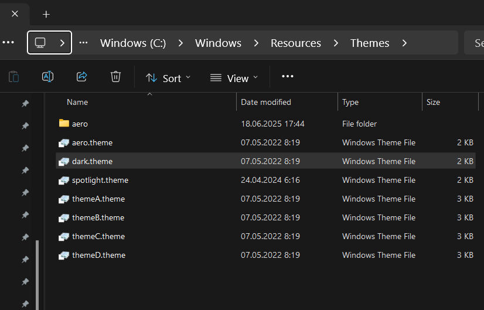
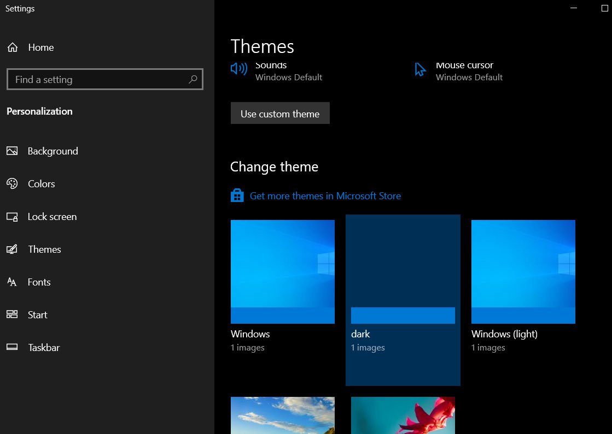

# Download Dark Mode .theme file windows server 2022

Date and Time: 2025-07-02 22:39

Simple Tags: #2025-07-02 #DarkModeWindowsServer

Problem: Dark Mode Not Working on Windows Server 2022 Datacenter

Solution: Copy dark.theme and light.theme files into C:\Windows\Resources\Themes as Admin

```makefile
Copy *.theme files into as Admin
C:\Windows\Resources\Themes
```

*Copy .theme files into C:\Windows\Resources\Themes as Admin


*enable in Personalization -> Themes


Done!


